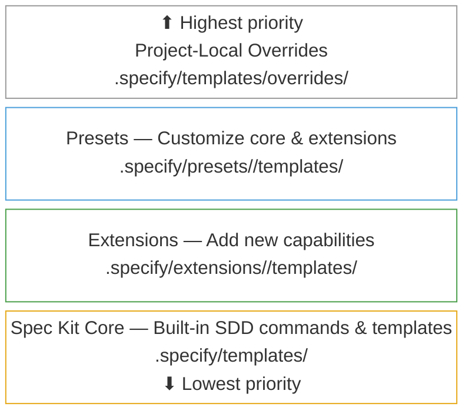

<div align="center">
    
    <h1>🌱 Spec Kit</h1>
    <h3><em>Build high-quality software faster.</em></h3>
</div>

<p align="center">
    <strong>An open source toolkit that allows you to focus on product scenarios and predictable outcomes instead of vibe coding every piece from scratch.</strong>
</p>

<p align="center">
    <a href="https://github.com/github/spec-kit/actions/workflows/release.yml"></a>
    <a href="https://github.com/github/spec-kit/stargazers"></a>
    <a href="https://github.com/github/spec-kit/blob/main/LICENSE"></a>
    <a href="https://github.github.io/spec-kit/"></a>
</p>

---

## Table of Contents

- [🤔 What is Spec-Driven Development?](#-what-is-spec-driven-development)
- [⚡ Get Started](#-get-started)
- [📽️ Video Overview](#️-video-overview)
- [🚶 Community Walkthroughs](#-community-walkthroughs)
- [🤖 Supported AI Agents](#-supported-ai-agents)
- [🔧 Specify CLI Reference](#-specify-cli-reference)
- [🧩 Making Spec Kit Your Own: Extensions & Presets](#-making-spec-kit-your-own-extensions--presets)
- [📚 Core Philosophy](#-core-philosophy)
- [🌟 Development Phases](#-development-phases)
- [🎯 Experimental Goals](#-experimental-goals)
- [🔧 Prerequisites](#-prerequisites)
- [📖 Learn More](#-learn-more)
- [📋 Detailed Process](#-detailed-process)
- [🔍 Troubleshooting](#-troubleshooting)
- [💬 Support](#-support)
- [🙏 Acknowledgements](#-acknowledgements)
- [📄 License](#-license)

## 🤔 What is Spec-Driven Development?

Spec-Driven Development **flips the script** on traditional software development. For decades, code has been king — specifications were just scaffolding we built and discarded once the "real work" of coding began. Spec-Driven Development changes this: **specifications become executable**, directly generating working implementations rather than just guiding them.

## ⚡ Get Started

### 1. Install Specify CLI

Choose your preferred installation method:

#### Option 1: Persistent Installation (Recommended)

Install once and use everywhere. Pin a specific release tag for stability (check [Releases](https://github.com/github/spec-kit/releases) for the latest):

```bash
# Install a specific stable release (recommended — replace vX.Y.Z with the latest tag)
uv tool install specify-cli --from git+https://github.com/github/spec-kit.git@vX.Y.Z

# Or install latest from main (may include unreleased changes)
uv tool install specify-cli --from git+https://github.com/github/spec-kit.git
```

Then use the tool directly:

```bash
# Create new project
specify init <PROJECT_NAME>

# Or initialize in existing project
specify init . --ai claude
# or
specify init --here --ai claude

# Check installed tools
specify check
```

To upgrade Specify, see the [Upgrade Guide](./docs/upgrade.md) for detailed instructions. Quick upgrade:

```bash
uv tool install specify-cli --force --from git+https://github.com/github/spec-kit.git@vX.Y.Z
```

#### Option 2: One-time Usage

Run directly without installing:

```bash
# Create new project (pinned to a stable release — replace vX.Y.Z with the latest tag)
uvx --from git+https://github.com/github/spec-kit.git@vX.Y.Z specify init <PROJECT_NAME>

# Or initialize in existing project
uvx --from git+https://github.com/github/spec-kit.git@vX.Y.Z specify init . --ai claude
# or
uvx --from git+https://github.com/github/spec-kit.git@vX.Y.Z specify init --here --ai claude
```

**Benefits of persistent installation:**

- Tool stays installed and available in PATH
- No need to create shell aliases
- Better tool management with `uv tool list`, `uv tool upgrade`, `uv tool uninstall`
- Cleaner shell configuration

#### Option 3: Enterprise / Air-Gapped Installation

If your environment blocks access to PyPI or GitHub, see the [Enterprise / Air-Gapped Installation](./docs/installation.md#enterprise--air-gapped-installation) guide for step-by-step instructions on using `pip download` to create portable, OS-specific wheel bundles on a connected machine.

### 2. Establish project principles

Launch your AI assistant in the project directory. Most agents expose spec-kit as `/speckit.*` slash commands; Codex CLI in skills mode uses `$speckit-*` instead.

Use the **`/speckit.constitution`** command to create your project's governing principles and development guidelines that will guide all subsequent development.

```bash
/speckit.constitution Create principles focused on code quality, testing standards, user experience consistency, and performance requirements
```

### 3. Create the spec

Use the **`/speckit.specify`** command to describe what you want to build. Focus on the **what** and **why**, not the tech stack.

```bash
/speckit.specify Build an application that can help me organize my photos in separate photo albums. Albums are grouped by date and can be re-organized by dragging and dropping on the main page. Albums are never in other nested albums. Within each album, photos are previewed in a tile-like interface.
```

### 4. Create a technical implementation plan

Use the **`/speckit.plan`** command to provide your tech stack and architecture choices.

```bash
/speckit.plan The application uses Vite with minimal number of libraries. Use vanilla HTML, CSS, and JavaScript as much as possible. Images are not uploaded anywhere and metadata is stored in a local SQLite database.
```

### 5. Break down into tasks

Use **`/speckit.tasks`** to create an actionable task list from your implementation plan.

```bash
/speckit.tasks
```

### 6. Execute implementation

Use **`/speckit.implement`** to execute all tasks and build your feature according to the plan.

```bash
/speckit.implement
```

For detailed step-by-step instructions, see our [comprehensive guide](./spec-driven.md).

## 📽️ Video Overview

Want to see Spec Kit in action? Watch our [video overview](https://www.youtube.com/watch?v=a9eR1xsfvHg&pp=0gcJCckJAYcqIYzv)!

[](https://www.youtube.com/watch?v=a9eR1xsfvHg&pp=0gcJCckJAYcqIYzv)

## 🚶 Community Walkthroughs

See Spec-Driven Development in action across different scenarios with these community-contributed walkthroughs:

- **[Greenfield .NET CLI tool](https://github.com/mnriem/spec-kit-dotnet-cli-demo)** — Builds a Timezone Utility as a .NET single-binary CLI tool from a blank directory, covering the full spec-kit workflow: constitution, specify, plan, tasks, and multi-pass implement using GitHub Copilot agents.

- **[Greenfield Spring Boot + React platform](https://github.com/mnriem/spec-kit-spring-react-demo)** — Builds an LLM performance analytics platform (REST API, graphs, iteration tracking) from scratch using Spring Boot, embedded React, PostgreSQL, and Docker Compose, with a clarify step and a cross-artifact consistency analysis pass included.

- **[Brownfield ASP.NET CMS extension](https://github.com/mnriem/spec-kit-aspnet-brownfield-demo)** — Extends an existing open-source .NET CMS (CarrotCakeCMS-Core, ~307,000 lines of C#, Razor, SQL, JavaScript, and config files) with two new features — cross-platform Docker Compose infrastructure and a token-authenticated headless REST API — demonstrating how spec-kit fits into existing codebases without prior specs or a constitution.

- **[Brownfield Java runtime extension](https://github.com/mnriem/spec-kit-java-brownfield-demo)** — Extends an existing open-source Jakarta EE runtime (Piranha, ~420,000 lines of Java, XML, JSP, HTML, and config files across 180 Maven modules) with a password-protected Server Admin Console, demonstrating spec-kit on a large multi-module Java project with no prior specs or constitution.

- **[Brownfield Go / React dashboard demo](https://github.com/mnriem/spec-kit-go-brownfield-demo)** — Demonstrates spec-kit driven entirely from the **terminal using GitHub Copilot CLI**. Extends NASA's open-source Hermes ground support system (Go) with a lightweight React-based web telemetry dashboard, showing that the full constitution → specify → plan → tasks → implement workflow works from the terminal.

- **[Greenfield Spring Boot MVC with a custom preset](https://github.com/mnriem/spec-kit-pirate-speak-preset-demo)** — Builds a Spring Boot MVC application from scratch using a custom pirate-speak preset, demonstrating how presets can reshape the entire spec-kit experience: specifications become "Voyage Manifests," plans become "Battle Plans," and tasks become "Crew Assignments" — all generated in full pirate vernacular without changing any tooling.

## 🤖 Supported AI Agents

| Agent                                                                                | Support | Notes                                                                                                                                     |
| ------------------------------------------------------------------------------------ | ------- | ----------------------------------------------------------------------------------------------------------------------------------------- |
| [Qoder CLI](https://qoder.com/cli)                                                   | ✅      |                                                                                                                                           |
| [Kiro CLI](https://kiro.dev/docs/cli/)                                               | ✅      | Use `--ai kiro-cli` (alias: `--ai kiro`)                                                                                                 |
| [Amp](https://ampcode.com/)                                                          | ✅      |                                                                                                                                           |
| [Auggie CLI](https://docs.augmentcode.com/cli/overview)                              | ✅      |                                                                                                                                           |
| [Claude Code](https://www.anthropic.com/claude-code)                                 | ✅      |                                                                                                                                           |
| [CodeBuddy CLI](https://www.codebuddy.ai/cli)                                        | ✅      |                                                                                                                                           |
| [Codex CLI](https://github.com/openai/codex)                                         | ✅      | Requires `--ai-skills`. Codex recommends [skills](https://developers.openai.com/codex/skills) and treats [custom prompts](https://developers.openai.com/codex/custom-prompts) as deprecated. Spec-kit installs Codex skills into `.agents/skills` and invokes them as `$speckit-<command>`. |
| [Cursor](https://cursor.sh/)                                                         | ✅      |                                                                                                                                           |
| [Gemini CLI](https://github.com/google-gemini/gemini-cli)                            | ✅      |                                                                                                                                           |
| [GitHub Copilot](https://code.visualstudio.com/)                                     | ✅      |                                                                                                                                           |
| [IBM Bob](https://www.ibm.com/products/bob)                                          | ✅      | IDE-based agent with slash command support                                                                                                |
| [Jules](https://jules.google.com/)                                                   | ✅      |                                                                                                                                           |
| [Kilo Code](https://github.com/Kilo-Org/kilocode)                                    | ✅      |                                                                                                                                           |
| [opencode](https://opencode.ai/)                                                     | ✅      |                                                                                                                                           |
| [Pi Coding Agent](https://pi.dev)                                                    | ✅      | Pi doesn't have MCP support out of the box, so `taskstoissues` won't work as intended. MCP support can be added via [extensions](https://github.com/badlogic/pi-mono/tree/main/packages/coding-agent#extensions) |
| [Qwen Code](https://github.com/QwenLM/qwen-code)                                     | ✅      |                                                                                                                                           |
| [Roo Code](https://roocode.com/)                                                     | ✅      |                                                                                                                                           |
| [SHAI (OVHcloud)](https://github.com/ovh/shai)                                       | ✅      |                                                                                                                                           |
| [Tabnine CLI](https://docs.tabnine.com/main/getting-started/tabnine-cli)             | ✅      |                                                                                                                                           |
| [Mistral Vibe](https://github.com/mistralai/mistral-vibe)                            | ✅      |                                                                                                                                           |
| [Kimi Code](https://code.kimi.com/)                                                  | ✅      |                                                                                                                                           |
| [iFlow CLI](https://docs.iflow.cn/en/cli/quickstart)                                 | ✅      |                                                                                                                                           |
| [Windsurf](https://windsurf.com/)                                                    | ✅      |                                                                                                                                           |
| [Junie](https://junie.jetbrains.com/)                                                | ✅      |                                                                                                                                           |
| [Antigravity (agy)](https://antigravity.google/)                                     | ✅      | Requires `--ai-skills` |
| [Trae](https://www.trae.ai/)                                                         | ✅      |                                                                                                                                           |
| Generic                                                                              | ✅      | Bring your own agent — use `--ai generic --ai-commands-dir <path>` for unsupported agents                                                 |

## 🔧 Specify CLI Reference

The `specify` command supports the following options:

### Commands

| Command | Description                                                                                                                                                                                                                                                                              |
| ------- |------------------------------------------------------------------------------------------------------------------------------------------------------------------------------------------------------------------------------------------------------------------------------------------|
| `init`  | Initialize a new Specify project from the latest template                                                                                                                                                                                                                                |
| `check` | Check for installed tools: `git` plus all CLI-based agents configured in `AGENT_CONFIG` (for example: `claude`, `gemini`, `code`/`code-insiders`, `cursor-agent`, `windsurf`, `junie`, `qwen`, `opencode`, `codex`, `kiro-cli`, `shai`, `qodercli`, `vibe`, `kimi`, `iflow`, `pi`, etc.) |

### `specify init` Arguments & Options

| Argument/Option        | Type     | Description                                                                                                                                                                                                                                                                                                                                                                               |
| ---------------------- | -------- |-------------------------------------------------------------------------------------------------------------------------------------------------------------------------------------------------------------------------------------------------------------------------------------------------------------------------------------------------------------------------------------------|
| `<project-name>`       | Argument | Name for your new project directory (optional if using `--here`, or use `.` for current directory)                                                                                                                                                                                                                                                                                        |
| `--ai`                 | Option   | AI assistant to use (see `AGENT_CONFIG` for the full, up-to-date list). Common options include: `claude`, `gemini`, `copilot`, `cursor-agent`, `qwen`, `opencode`, `codex`, `windsurf`, `junie`, `kilocode`, `auggie`, `roo`, `codebuddy`, `amp`, `shai`, `kiro-cli` (`kiro` alias), `agy`, `bob`, `qodercli`, `vibe`, `kimi`, `iflow`, `pi`, or `generic` (requires `--ai-commands-dir`) |
| `--ai-commands-dir`    | Option   | Directory for agent command files (required with `--ai generic`, e.g. `.myagent/commands/`)                                                                                                                                                                                                                                                                                               |
| `--script`             | Option   | Script variant to use: `sh` (bash/zsh) or `ps` (PowerShell)                                                                                                                                                                                                                                                                                                                               |
| `--ignore-agent-tools` | Flag     | Skip checks for AI agent tools like Claude Code                                                                                                                                                                                                                                                                                                                                           |
| `--no-git`             | Flag     | Skip git repository initialization                                                                                                                                                                                                                                                                                                                                                        |
| `--here`               | Flag     | Initialize project in the current directory instead of creating a new one                                                                                                                                                                                                                                                                                                                 |
| `--force`              | Flag     | Force merge/overwrite when initializing in current directory (skip confirmation)                                                                                                                                                                                                                                                                                                          |
| `--skip-tls`           | Flag     | Skip SSL/TLS verification (not recommended)                                                                                                                                                                                                                                                                                                                                               |
| `--debug`              | Flag     | Enable detailed debug output for troubleshooting                                                                                                                                                                                                                                                                                                                                          |
| `--github-token`       | Option   | GitHub token for API requests (or set GH_TOKEN/GITHUB_TOKEN env variable)                                                                                                                                                                                                                                                                                                                 |
| `--ai-skills`          | Flag     | Install Prompt.MD templates as agent skills in agent-specific `skills/` directory (requires `--ai`)                                                                                                                                                                                                                                                                                       |
| `--branch-numbering`   | Option   | Branch numbering strategy: `sequential` (default — `001`, `002`, `003`) or `timestamp` (`YYYYMMDD-HHMMSS`). Timestamp mode is useful for distributed teams to avoid numbering conflicts                                                                                                                                                                                                  |

### Examples

```bash
# Basic project initialization
specify init my-project

# Initialize with specific AI assistant
specify init my-project --ai claude

# Initialize with Cursor support
specify init my-project --ai cursor-agent

# Initialize with Qoder support
specify init my-project --ai qodercli

# Initialize with Windsurf support
specify init my-project --ai windsurf

# Initialize with Kiro CLI support
specify init my-project --ai kiro-cli

# Initialize with Amp support
specify init my-project --ai amp

# Initialize with SHAI support
specify init my-project --ai shai

# Initialize with Mistral Vibe support
specify init my-project --ai vibe

# Initialize with IBM Bob support
specify init my-project --ai bob

# Initialize with Pi Coding Agent support
specify init my-project --ai pi

# Initialize with Codex CLI support
specify init my-project --ai codex --ai-skills

# Initialize with Antigravity support
specify init my-project --ai agy --ai-skills

# Initialize with an unsupported agent (generic / bring your own agent)
specify init my-project --ai generic --ai-commands-dir .myagent/commands/

# Initialize with PowerShell scripts (Windows/cross-platform)
specify init my-project --ai copilot --script ps

# Initialize in current directory
specify init . --ai copilot
# or use the --here flag
specify init --here --ai copilot

# Force merge into current (non-empty) directory without confirmation
specify init . --force --ai copilot
# or
specify init --here --force --ai copilot

# Skip git initialization
specify init my-project --ai gemini --no-git

# Enable debug output for troubleshooting
specify init my-project --ai claude --debug

# Use GitHub token for API requests (helpful for corporate environments)
specify init my-project --ai claude --github-token ghp_your_token_here

# Install agent skills with the project
specify init my-project --ai claude --ai-skills

# Initialize in current directory with agent skills
specify init --here --ai gemini --ai-skills

# Use timestamp-based branch numbering (useful for distributed teams)
specify init my-project --ai claude --branch-numbering timestamp

# Check system requirements
specify check
```

### Available Slash Commands

After running `specify init`, your AI coding agent will have access to these slash commands for structured development.

For Codex CLI, `--ai-skills` installs spec-kit as agent skills instead of slash-command prompt files. In Codex skills mode, invoke spec-kit as `$speckit-constitution`, `$speckit-specify`, `$speckit-plan`, `$speckit-tasks`, and `$speckit-implement`.

#### Core Commands

Essential commands for the Spec-Driven Development workflow:

| Command                 | Description                                                              |
| ----------------------- | ------------------------------------------------------------------------ |
| `/speckit.constitution` | Create or update project governing principles and development guidelines |
| `/speckit.specify`      | Define what you want to build (requirements and user stories)            |
| `/speckit.plan`         | Create technical implementation plans with your chosen tech stack        |
| `/speckit.tasks`        | Generate actionable task lists for implementation                        |
| `/speckit.implement`    | Execute all tasks to build the feature according to the plan             |

#### Optional Commands

Additional commands for enhanced quality and validation:

| Command              | Description                                                                                                                          |
| -------------------- | ------------------------------------------------------------------------------------------------------------------------------------ |
| `/speckit.clarify`   | Clarify underspecified areas (recommended before `/speckit.plan`; formerly `/quizme`)                                                |
| `/speckit.analyze`   | Cross-artifact consistency & coverage analysis (run after `/speckit.tasks`, before `/speckit.implement`)                             |
| `/speckit.checklist` | Generate custom quality checklists that validate requirements completeness, clarity, and consistency (like "unit tests for English") |

### Environment Variables

| Variable          | Description                                                                                                                                                                                                                                                                                            |
| ----------------- | ------------------------------------------------------------------------------------------------------------------------------------------------------------------------------------------------------------------------------------------------------------------------------------------------------ |
| `SPECIFY_FEATURE` | Override feature detection for non-Git repositories. Set to the feature directory name (e.g., `001-photo-albums`) to work on a specific feature when not using Git branches.<br/>\*\*Must be set in the context of the agent you're working with prior to using `/speckit.plan` or follow-up commands. |

## 🧩 Making Spec Kit Your Own: Extensions & Presets

Spec Kit can be tailored to your needs through two complementary systems — **extensions** and **presets** — plus project-local overrides for one-off adjustments:



**Templates** are resolved at **runtime** — Spec Kit walks the stack top-down and uses the first match. Project-local overrides (`.specify/templates/overrides/`) let you make one-off adjustments for a single project without creating a full preset. **Commands** are applied at **install time** — when you run `specify extension add` or `specify preset add`, command files are written into agent directories (e.g., `.claude/commands/`). If multiple presets or extensions provide the same command, the highest-priority version wins. On removal, the next-highest-priority version is restored automatically. If no overrides or customizations exist, Spec Kit uses its core defaults.

### Extensions — Add New Capabilities

Use **extensions** when you need functionality that goes beyond Spec Kit's core. Extensions introduce new commands and templates — for example, adding domain-specific workflows that are not covered by the built-in SDD commands, integrating with external tools, or adding entirely new development phases. They expand *what Spec Kit can do*.

```bash
# Search available extensions
specify extension search

# Install an extension
specify extension add <extension-name>
```

For example, extensions could add Jira integration, post-implementation code review, V-Model test traceability, or project health diagnostics.

See the [Extensions README](./extensions/README.md) for the full guide, the complete community catalog, and how to build and publish your own.

### Presets — Customize Existing Workflows

Use **presets** when you want to change *how* Spec Kit works without adding new capabilities. Presets override the templates and commands that ship with the core *and* with installed extensions — for example, enforcing a compliance-oriented spec format, using domain-specific terminology, or applying organizational standards to plans and tasks. They customize the artifacts and instructions that Spec Kit and its extensions produce.

```bash
# Search available presets
specify preset search

# Install a preset
specify preset add <preset-name>
```

For example, presets could restructure spec templates to require regulatory traceability, adapt the workflow to fit the methodology you use (e.g., Agile, Kanban, Waterfall, jobs-to-be-done, or domain-driven design), add mandatory security review gates to plans, enforce test-first task ordering, or localize the entire workflow to a different language. The [pirate-speak demo](https://github.com/mnriem/spec-kit-pirate-speak-preset-demo) shows just how deep the customization can go. Multiple presets can be stacked with priority ordering.

See the [Presets README](./presets/README.md) for the full guide, including resolution order, priority, and how to create your own.

### When to Use Which

| Goal | Use |
| --- | --- |
| Add a brand-new command or workflow | Extension |
| Customize the format of specs, plans, or tasks | Preset |
| Integrate an external tool or service | Extension |
| Enforce organizational or regulatory standards | Preset |
| Ship reusable domain-specific templates | Either — presets for template overrides, extensions for templates bundled with new commands |

## 📚 Core Philosophy

Spec-Driven Development is a structured process that emphasizes:

- **Intent-driven development** where specifications define the "*what*" before the "*how*"
- **Rich specification creation** using guardrails and organizational principles
- **Multi-step refinement** rather than one-shot code generation from prompts
- **Heavy reliance** on advanced AI model capabilities for specification interpretation

## 🌟 Development Phases

| Phase                                    | Focus                    | Key Activities                                                                                                                                                     |
| ---------------------------------------- | ------------------------ | ------------------------------------------------------------------------------------------------------------------------------------------------------------------ |
| **0-to-1 Development** ("Greenfield")    | Generate from scratch    | <ul><li>Start with high-level requirements</li><li>Generate specifications</li><li>Plan implementation steps</li><li>Build production-ready applications</li></ul> |
| **Creative Exploration**                 | Parallel implementations | <ul><li>Explore diverse solutions</li><li>Support multiple technology stacks & architectures</li><li>Experiment with UX patterns</li></ul>                         |
| **Iterative Enhancement** ("Brownfield") | Brownfield modernization | <ul><li>Add features iteratively</li><li>Modernize legacy systems</li><li>Adapt processes</li></ul>                                                                |

## 🎯 Experimental Goals

Our research and experimentation focus on:

### Technology independence

- Create applications using diverse technology stacks
- Validate the hypothesis that Spec-Driven Development is a process not tied to specific technologies, programming languages, or frameworks

### Enterprise constraints

- Demonstrate mission-critical application development
- Incorporate organizational constraints (cloud providers, tech stacks, engineering practices)
- Support enterprise design systems and compliance requirements

### User-centric development

- Build applications for different user cohorts and preferences
- Support various development approaches (from vibe-coding to AI-native development)

### Creative & iterative processes

- Validate the concept of parallel implementation exploration
- Provide robust iterative feature development workflows
- Extend processes to handle upgrades and modernization tasks

## 🔧 Prerequisites

- **Linux/macOS/Windows**
- [Supported](#-supported-ai-agents) AI coding agent.
- [uv](https://docs.astral.sh/uv/) for package management
- [Python 3.11+](https://www.python.org/downloads/)
- [Git](https://git-scm.com/downloads)

If you encounter issues with an agent, please open an issue so we can refine the integration.

## 📖 Learn More

- **[Complete Spec-Driven Development Methodology](./spec-driven.md)** - Deep dive into the full process
- **[Detailed Walkthrough](#-detailed-process)** - Step-by-step implementation guide

---

## 📋 Detailed Process

<details>
<summary>Click to expand the detailed step-by-step walkthrough</summary>

You can use the Specify CLI to bootstrap your project, which will bring in the required artifacts in your environment. Run:

```bash
specify init <project_name>
```

Or initialize in the current directory:

```bash
specify init .
# or use the --here flag
specify init --here
# Skip confirmation when the directory already has files
specify init . --force
# or
specify init --here --force
```


You will be prompted to select the AI agent you are using. You can also proactively specify it directly in the terminal:

```bash
specify init <project_name> --ai claude
specify init <project_name> --ai gemini
specify init <project_name> --ai copilot

# Or in current directory:
specify init . --ai claude
specify init . --ai codex --ai-skills

# or use --here flag
specify init --here --ai claude
specify init --here --ai codex --ai-skills

# Force merge into a non-empty current directory
specify init . --force --ai claude

# or
specify init --here --force --ai claude
```

The CLI will check if you have Claude Code, Gemini CLI, Cursor CLI, Qwen CLI, opencode, Codex CLI, Qoder CLI, Tabnine CLI, Kiro CLI, Pi, or Mistral Vibe installed. If you do not, or you prefer to get the templates without checking for the right tools, use `--ignore-agent-tools` with your command:

```bash
specify init <project_name> --ai claude --ignore-agent-tools
```

### **STEP 1:** Establish project principles

Go to the project folder and run your AI agent. In our example, we're using `claude`.


You will know that things are configured correctly if you see the `/speckit.constitution`, `/speckit.specify`, `/speckit.plan`, `/speckit.tasks`, and `/speckit.implement` commands available.

The first step should be establishing your project's governing principles using the `/speckit.constitution` command. This helps ensure consistent decision-making throughout all subsequent development phases:

```text
/speckit.constitution Create principles focused on code quality, testing standards, user experience consistency, and performance requirements. Include governance for how these principles should guide technical decisions and implementation choices.
```

This step creates or updates the `.specify/memory/constitution.md` file with your project's foundational guidelines that the AI agent will reference during specification, planning, and implementation phases.

### **STEP 2:** Create project specifications

With your project principles established, you can now create the functional specifications. Use the `/speckit.specify` command and then provide the concrete requirements for the project you want to develop.

> [!IMPORTANT]
> Be as explicit as possible about *what* you are trying to build and *why*. **Do not focus on the tech stack at this point**.

An example prompt:

```text
Develop Taskify, a team productivity platform. It should allow users to create projects, add team members,
assign tasks, comment and move tasks between boards in Kanban style. In this initial phase for this feature,
let's call it "Create Taskify," let's have multiple users but the users will be declared ahead of time, predefined.
I want five users in two different categories, one product manager and four engineers. Let's create three
different sample projects. Let's have the standard Kanban columns for the status of each task, such as "To Do,"
"In Progress," "In Review," and "Done." There will be no login for this application as this is just the very
first testing thing to ensure that our basic features are set up. For each task in the UI for a task card,
you should be able to change the current status of the task between the different columns in the Kanban work board.
You should be able to leave an unlimited number of comments for a particular card. You should be able to, from that task
card, assign one of the valid users. When you first launch Taskify, it's going to give you a list of the five users to pick
from. There will be no password required. When you click on a user, you go into the main view, which displays the list of
projects. When you click on a project, you open the Kanban board for that project. You're going to see the columns.
You'll be able to drag and drop cards back and forth between different columns. You will see any cards that are
assigned to you, the currently logged in user, in a different color from all the other ones, so you can quickly
see yours. You can edit any comments that you make, but you can't edit comments that other people made. You can
delete any comments that you made, but you can't delete comments anybody else made.
```

After this prompt is entered, you should see Claude Code kick off the planning and spec drafting process. Claude Code will also trigger some of the built-in scripts to set up the repository.

Once this step is completed, you should have a new branch created (e.g., `001-create-taskify`), as well as a new specification in the `specs/001-create-taskify` directory.

The produced specification should contain a set of user stories and functional requirements, as defined in the template.

At this stage, your project folder contents should resemble the following:

```text
└── .specify
    ├── memory
    │  └── constitution.md
    ├── scripts
    │  ├── check-prerequisites.sh
    │  ├── common.sh
    │  ├── create-new-feature.sh
    │  ├── setup-plan.sh
    │  └── update-claude-md.sh
    ├── specs
    │  └── 001-create-taskify
    │      └── spec.md
    └── templates
        ├── plan-template.md
        ├── spec-template.md
        └── tasks-template.md
```

### **STEP 3:** Functional specification clarification (required before planning)

With the baseline specification created, you can go ahead and clarify any of the requirements that were not captured properly within the first shot attempt.

You should run the structured clarification workflow **before** creating a technical plan to reduce rework downstream.

Preferred order:

1. Use `/speckit.clarify` (structured) – sequential, coverage-based questioning that records answers in a Clarifications section.
2. Optionally follow up with ad-hoc free-form refinement if something still feels vague.

If you intentionally want to skip clarification (e.g., spike or exploratory prototype), explicitly state that so the agent doesn't block on missing clarifications.

Example free-form refinement prompt (after `/speckit.clarify` if still needed):

```text
For each sample project or project that you create there should be a variable number of tasks between 5 and 15
tasks for each one randomly distributed into different states of completion. Make sure that there's at least
one task in each stage of completion.
```

You should also ask Claude Code to validate the **Review & Acceptance Checklist**, checking off the things that are validated/pass the requirements, and leave the ones that are not unchecked. The following prompt can be used:

```text
Read the review and acceptance checklist, and check off each item in the checklist if the feature spec meets the criteria. Leave it empty if it does not.
```

It's important to use the interaction with Claude Code as an opportunity to clarify and ask questions around the specification - **do not treat its first attempt as final**.

### **STEP 4:** Generate a plan

You can now be specific about the tech stack and other technical requirements. You can use the `/speckit.plan` command that is built into the project template with a prompt like this:

```text
We are going to generate this using .NET Aspire, using Postgres as the database. The frontend should use
Blazor server with drag-and-drop task boards, real-time updates. There should be a REST API created with a projects API,
tasks API, and a notifications API.
```

The output of this step will include a number of implementation detail documents, with your directory tree resembling this:

```text
.
├── CLAUDE.md
├── memory
│  └── constitution.md
├── scripts
│  ├── check-prerequisites.sh
│  ├── common.sh
│  ├── create-new-feature.sh
│  ├── setup-plan.sh
│  └── update-claude-md.sh
├── specs
│  └── 001-create-taskify
│      ├── contracts
│      │  ├── api-spec.json
│      │  └── signalr-spec.md
│      ├── data-model.md
│      ├── plan.md
│      ├── quickstart.md
│      ├── research.md
│      └── spec.md
└── templates
    ├── CLAUDE-template.md
    ├── plan-template.md
    ├── spec-template.md
    └── tasks-template.md
```

Check the `research.md` document to ensure that the right tech stack is used, based on your instructions. You can ask Claude Code to refine it if any of the components stand out, or even have it check the locally-installed version of the platform/framework you want to use (e.g., .NET).

Additionally, you might want to ask Claude Code to research details about the chosen tech stack if it's something that is rapidly changing (e.g., .NET Aspire, JS frameworks), with a prompt like this:

```text
I want you to go through the implementation plan and implementation details, looking for areas that could
benefit from additional research as .NET Aspire is a rapidly changing library. For those areas that you identify that
require further research, I want you to update the research document with additional details about the specific
versions that we are going to be using in this Taskify application and spawn parallel research tasks to clarify
any details using research from the web.
```

During this process, you might find that Claude Code gets stuck researching the wrong thing - you can help nudge it in the right direction with a prompt like this:

```text
I think we need to break this down into a series of steps. First, identify a list of tasks
that you would need to do during implementation that you're not sure of or would benefit
from further research. Write down a list of those tasks. And then for each one of these tasks,
I want you to spin up a separate research task so that the net results is we are researching
all of those very specific tasks in parallel. What I saw you doing was it looks like you were
researching .NET Aspire in general and I don't think that's gonna do much for us in this case.
That's way too untargeted research. The research needs to help you solve a specific targeted question.
```

> [!NOTE]
> Claude Code might be over-eager and add components that you did not ask for. Ask it to clarify the rationale and the source of the change.

### **STEP 5:** Have Claude Code validate the plan

With the plan in place, you should have Claude Code run through it to make sure that there are no missing pieces. You can use a prompt like this:

```text
Now I want you to go and audit the implementation plan and the implementation detail files.
Read through it with an eye on determining whether or not there is a sequence of tasks that you need
to be doing that are obvious from reading this. Because I don't know if there's enough here. For example,
when I look at the core implementation, it would be useful to reference the appropriate places in the implementation
details where it can find the information as it walks through each step in the core implementation or in the refinement.
```

This helps refine the implementation plan and helps you avoid potential blind spots that Claude Code missed in its planning cycle. Once the initial refinement pass is complete, ask Claude Code to go through the checklist once more before you can get to the implementation.

You can also ask Claude Code (if you have the [GitHub CLI](https://docs.github.com/en/github-cli/github-cli) installed) to go ahead and create a pull request from your current branch to `main` with a detailed description, to make sure that the effort is properly tracked.

> [!NOTE]
> Before you have the agent implement it, it's also worth prompting Claude Code to cross-check the details to see if there are any over-engineered pieces (remember - it can be over-eager). If over-engineered components or decisions exist, you can ask Claude Code to resolve them. Ensure that Claude Code follows the [constitution](base/memory/constitution.md) as the foundational piece that it must adhere to when establishing the plan.

### **STEP 6:** Generate task breakdown with /speckit.tasks

With the implementation plan validated, you can now break down the plan into specific, actionable tasks that can be executed in the correct order. Use the `/speckit.tasks` command to automatically generate a detailed task breakdown from your implementation plan:

```text
/speckit.tasks
```

This step creates a `tasks.md` file in your feature specification directory that contains:

- **Task breakdown organized by user story** - Each user story becomes a separate implementation phase with its own set of tasks
- **Dependency management** - Tasks are ordered to respect dependencies between components (e.g., models before services, services before endpoints)
- **Parallel execution markers** - Tasks that can run in parallel are marked with `[P]` to optimize development workflow
- **File path specifications** - Each task includes the exact file paths where implementation should occur
- **Test-driven development structure** - If tests are requested, test tasks are included and ordered to be written before implementation
- **Checkpoint validation** - Each user story phase includes checkpoints to validate independent functionality

The generated tasks.md provides a clear roadmap for the `/speckit.implement` command, ensuring systematic implementation that maintains code quality and allows for incremental delivery of user stories.

### **STEP 7:** Implementation

Once ready, use the `/speckit.implement` command to execute your implementation plan:

```text
/speckit.implement
```

The `/speckit.implement` command will:

- Validate that all prerequisites are in place (constitution, spec, plan, and tasks)
- Parse the task breakdown from `tasks.md`
- Execute tasks in the correct order, respecting dependencies and parallel execution markers
- Follow the TDD approach defined in your task plan
- Provide progress updates and handle errors appropriately

> [!IMPORTANT]
> The AI agent will execute local CLI commands (such as `dotnet`, `npm`, etc.) - make sure you have the required tools installed on your machine.

Once the implementation is complete, test the application and resolve any runtime errors that may not be visible in CLI logs (e.g., browser console errors). You can copy and paste such errors back to your AI agent for resolution.

</details>

---

## 🔍 Troubleshooting

### Git Credential Manager on Linux

If you're having issues with Git authentication on Linux, you can install Git Credential Manager:

```bash
#!/usr/bin/env bash
set -e
echo "Downloading Git Credential Manager v2.6.1..."
wget https://github.com/git-ecosystem/git-credential-manager/releases/download/v2.6.1/gcm-linux_amd64.2.6.1.deb
echo "Installing Git Credential Manager..."
sudo dpkg -i gcm-linux_amd64.2.6.1.deb
echo "Configuring Git to use GCM..."
git config --global credential.helper manager
echo "Cleaning up..."
rm gcm-linux_amd64.2.6.1.deb
```

## 💬 Support

For support, please open a [GitHub issue](https://github.com/github/spec-kit/issues/new). We welcome bug reports, feature requests, and questions about using Spec-Driven Development.

## 🙏 Acknowledgements

This project is heavily influenced by and based on the work and research of [John Lam](https://github.com/jflam).

## 📄 License

This project is licensed under the terms of the MIT open source license. Please refer to the [LICENSE](./LICENSE) file for the full terms.
